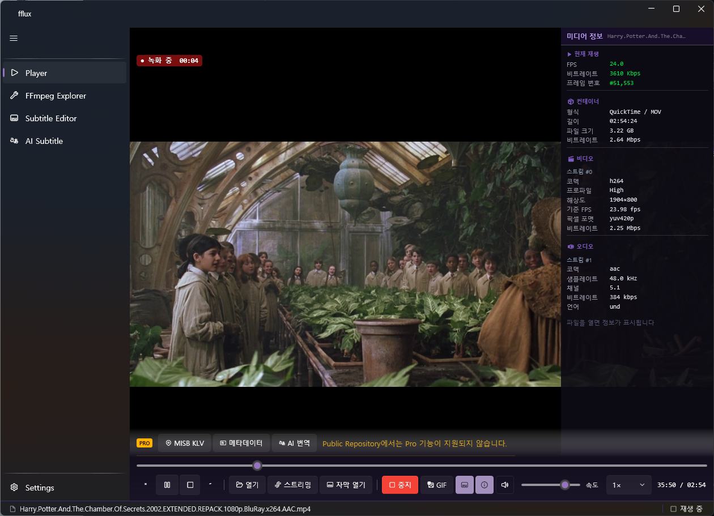
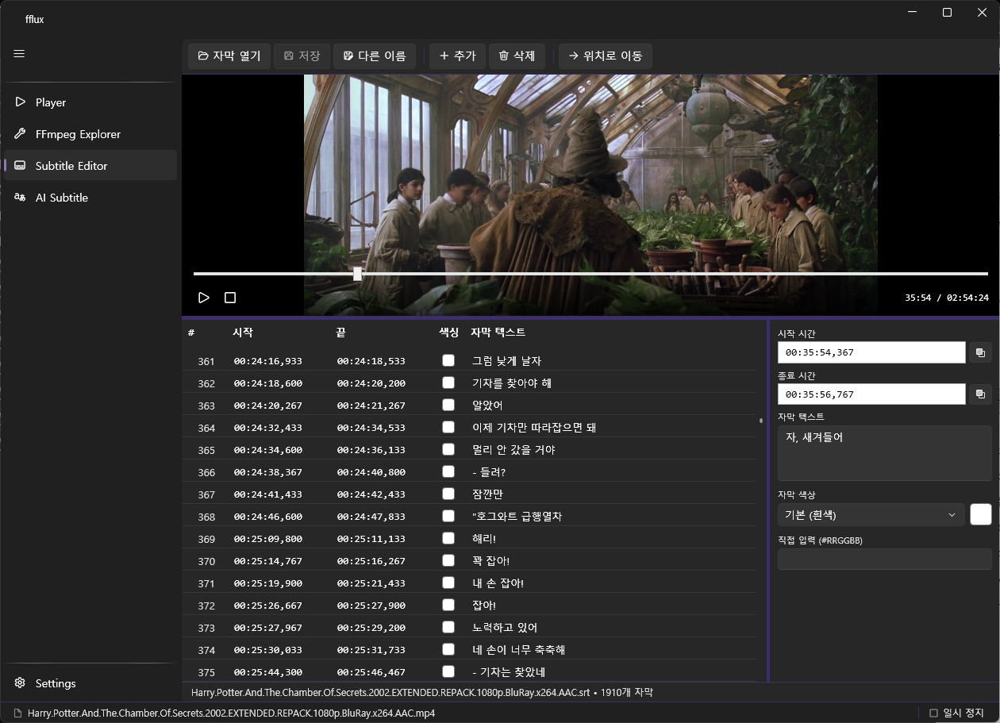
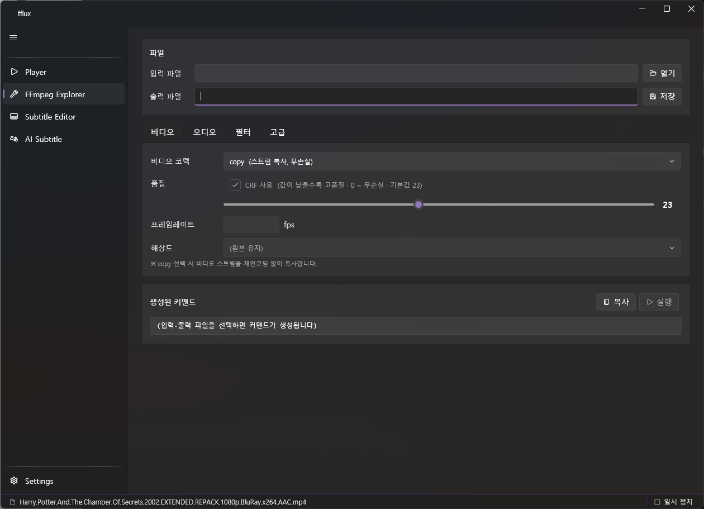
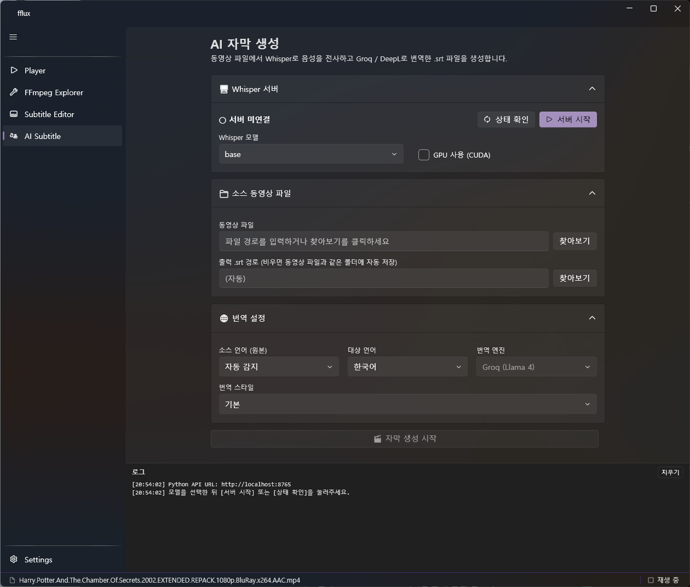
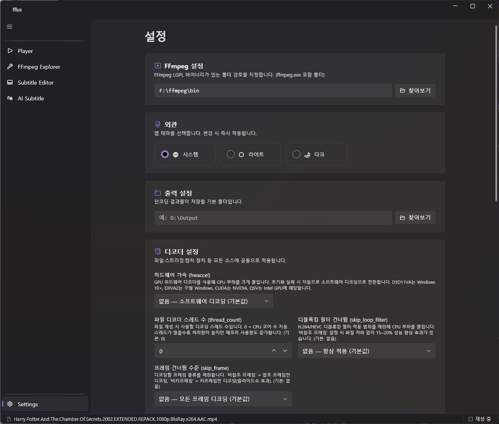

# fflux

🌐 [English](README.md) | **한국어**

**ffmpeg.autogen 기반 WPF 비디오 플레이어** — Developer-focused media player built on ffmpeg.autogen + WPF (.NET 10)

[](LICENSE.txt)
[](https://dotnet.microsoft.com/download/dotnet/10.0)
[]()
[](https://github.com/Ruslan-B/FFmpeg.AutoGen)
[](https://github.com/sponsors/imbae)

개발자 지향 고급 기능(실시간 통계, 구간 녹화, 자막 편집, AI 자막 생성, MISB KLV 파싱)을 ffmpeg.autogen API로 직접 구현한 WPF 비디오 플레이어입니다. 외부 ffmpeg.exe 프로세스 호출 없이 라이브러리를 직접 사용하며, GPL 코덱 없이 LGPL 조건을 완전히 준수합니다.

---



---

## 목차

- [기능 개요](#기능-개요)
- [스크린샷](#스크린샷)
- [시작하기](#시작하기)
  - [사전 요구사항](#사전-요구사항)
  - [FFmpeg 바이너리 설정](#ffmpeg-바이너리-설정)
- [플레이어 사용법](#플레이어-사용법)
- [자막 편집기](#자막-편집기)
- [FFmpeg Explorer](#ffmpeg-explorer)
- [AI 자막 생성 (PRO)](#ai-자막-생성-pro)
- [MISB KLV 메타데이터 (PRO)](#misb-klv-메타데이터-pro)
- [소스 빌드](#소스-빌드)
- [라이선스](#라이선스)

---

## 기능 개요

| 기능 | 설명 | 무료 |
|------|------|:----:|
| 비디오 재생 | MP4 · MKV · AVI · MOV · WMV · WebM · TS 등 | ✅ |
| 라이브 스트리밍 | RTSP · RTP · UDP 주소 직접 입력 | ✅ |
| 오디오 출력 | WASAPI 저지연 출력, 볼륨/음소거 | ✅ |
| 재생 제어 | 배속 조정(0.25×~2×), 프레임 스텝, 시크 | ✅ |
| 실시간 통계 | FPS · 비트레이트 · 프레임 번호 실시간 표시 | ✅ |
| 미디어 정보 패널 | 코덱 · 해상도 · 스트림 정보 슬라이딩 패널 | ✅ |
| 구간 녹화 | Stream Copy 무손실 녹화, GIF 내보내기 | ✅ |
| 자막 편집기 | SRT/VTT 읽기·편집·저장, 재생 위치 연동 | ✅ |
| FFmpeg Explorer | FFmpeg 옵션 GUI 빌더 + 커맨드 생성기 | ✅ |
| **AI 자막 생성** | Whisper 전사 + Groq/DeepL 번역 → .srt 출력 | 🔒 PRO |
| **실시간 AI 번역** | 재생 중 음성을 실시간 전사·번역 오버레이 | 🔒 PRO |
| **MISB KLV** | KLV 메타데이터 파싱 + VMTI 바운딩 박스 오버레이 | 🔒 PRO |

---

## 스크린샷

### 비디오 플레이어 — 미디어 정보 패널 · 구간 녹화


재생 중 우측 패널에서 코덱·해상도·비트레이트·스트림 정보를 실시간 확인합니다. 하단 컨트롤 바에서 구간 녹화(Stream Copy)를 시작하면 재인코딩 없이 원본 품질로 저장됩니다.

### 자막 편집기



SRT/VTT 파일을 불러와 타임스탬프·텍스트를 인라인 편집하고, 해당 구간의 영상을 미리보기 패널에서 바로 확인합니다.

### FFmpeg Explorer



복잡한 FFmpeg 옵션을 GUI로 조립하고 커맨드라인을 자동 생성합니다. 복사 또는 즉시 실행이 가능합니다.

### AI 자막 생성 (PRO)



Whisper 서버를 내장 UI로 시작하고, 동영상에서 음성을 전사한 뒤 Groq(Llama 4) 또는 DeepL로 번역하여 `.srt` 파일을 생성합니다.

### 설정



FFmpeg 경로, 테마, 하드웨어 가속(D3D11VA·DXVA2·CUDA·QSV), 디코더 스레드 수 등을 설정합니다.

---

## 시작하기

### 사전 요구사항

| 항목 | 버전 | 비고 |
|------|------|------|
| Windows | 10 / 11 (x64) | |
| [.NET 10 Desktop Runtime](https://dotnet.microsoft.com/download/dotnet/10.0) | 10.0+ | 실행 필수 |
| [FFmpeg LGPL 빌드](https://github.com/BtbN/FFmpeg-Builds/releases) | 7.x / 8.x | `ffmpeg.exe` 포함 폴더 |
| Python *(AI 자막 기능만)* | 3.9 이상 | PATH 등록 필수 |

> ⚠️ **FFmpeg GPL 빌드 사용 금지** — fflux는 LGPL 라이선스를 준수합니다. GPL 코덱(x264, x265 등)이 포함된 빌드를 사용하면 LGPL 조건을 위반합니다.  
> [BtbN FFmpeg-Builds](https://github.com/BtbN/FFmpeg-Builds/releases) 에서 `ffmpeg-master-latest-win64-lgpl.zip`을 다운로드하세요.

### FFmpeg 바이너리 설정

1. fflux 실행 후 좌측 메뉴 **Settings** 진입
2. **FFmpeg 설정** 카드 → `ffmpeg.exe`가 있는 폴더 경로 입력
3. **설정 저장** 클릭 → FFmpeg 초기화 성공 메시지 확인

---

## 플레이어 사용법

### 파일 열기

- 하단 컨트롤 바 **[열기]** 버튼 또는 비디오 영역에 파일 드래그앤드롭
- 자막 파일(`.srt`, `.vtt`)을 드롭하면 자막만 교체

### 스트리밍

하단 **[스트리밍]** 버튼 → URL 입력 → **[열기]**

```
지원 스킴: rtsp://  rtp://  udp://  srt://  rtmp://  rtmps://

예시:
  rtsp://192.168.0.1:554/stream
  udp://@239.0.0.1:1234
```

### 키보드 단축키

| 키 | 동작 |
|----|------|
| `Space` | 재생 / 일시정지 |
| `←` / `→` | 5초 뒤로 / 앞으로 |
| `Ctrl+←` / `Ctrl+→` | 이전 프레임 / 다음 프레임 |
| `M` | 음소거 토글 |
| `F` | 전체화면 토글 |
| `V` | 자막 표시/숨김 |
| `Escape` | 전체화면 해제 |

### 구간 녹화

하단 컨트롤 바 **[녹화]** 버튼 → 원하는 시점에 **[중지]** 버튼  
(Stream Copy — 재인코딩 없이 원본 품질 그대로 MKV/MP4/TS로 저장)

---

## 자막 편집기

좌측 메뉴 **Subtitle Editor** 진입


- SRT / VTT 파일을 드롭하거나 **[자막 열기]** 버튼으로 불러오기
- 동영상 파일을 드롭하면 동일 이름의 자막이 있으면 함께 로드
- DataGrid에서 타임스탬프·텍스트 인라인 편집
- **[위치로 이동]** 버튼 → 해당 자막 구간의 비디오 프레임 미리보기
- `Ctrl+S` 저장 / `Insert` 행 추가 / `Ctrl+Del` 행 삭제

---

## FFmpeg Explorer

좌측 메뉴 **FFmpeg Explorer** 진입


복잡한 FFmpeg 커맨드 라인을 GUI로 조립합니다.

- 입력 파일 · 출력 파일 선택
- 비디오/오디오/필터 옵션을 드롭다운/슬라이더로 설정
- 생성된 커맨드를 클립보드 복사 또는 직접 실행

---

## AI 자막 생성 (PRO)

> PRO 기능 — `fflux.AiSubtitle` private 서브모듈이 포함된 빌드에서만 활성화됩니다.


동영상 파일에서 **Whisper**로 음성을 전사하고 **Groq(Llama 4)** 또는 **DeepL**로 번역하여 `.srt` 파일을 생성합니다.

### 환경 변수 설정 (`.env`)

프로젝트 루트 또는 실행 파일 디렉터리에 `.env` 파일을 생성합니다  
(`.env.example`을 복사하여 편집하세요).

```dotenv
# ── Groq API 키 (필수) ────────────────────────────────────────
# 발급: https://console.groq.com → API Keys → Create API Key
# 무료 플랜 제공 (분당 요청 제한 있음)
GROQ_API_KEY=gsk_xxxxxxxxxxxxxxxxxxxxxxxxxxxx

# ── 번역 AI 모델 (선택 — 기본값으로 동작) ────────────────────
AI_MODEL=meta-llama/llama-4-scout-17b-16e-instruct

# ── OpenAI 호환 엔드포인트 (선택 — 변경 불필요) ──────────────
AI_PROVIDER=https://api.groq.com/openai/v1

# ── Python Whisper 서버 URL ───────────────────────────────────
PYTHON_API_URL=http://localhost:8765

# ── DeepL API 키 (선택) ───────────────────────────────────────
# DEEPL_API_KEY=
```

| 변수 | 필수 | 설명 | 발급처 |
|------|:----:|------|--------|
| `GROQ_API_KEY` | ✅ | Groq LLM/Whisper API 인증 키 | [console.groq.com](https://console.groq.com) |
| `AI_MODEL` | — | 번역에 사용할 Llama 모델명 | — |
| `AI_PROVIDER` | — | OpenAI 호환 엔드포인트 URL | — |
| `PYTHON_API_URL` | ✅ | Whisper 전사 서버 URL | 직접 실행 또는 원격 서버 |
| `DEEPL_API_KEY` | — | DeepL 번역 엔진 (없으면 Groq 번역만 사용) | [deepl.com/pro-api](https://www.deepl.com/pro-api) |

### Python Whisper 서버 설치 및 실행

AI 자막 생성은 [faster-whisper](https://github.com/SYSTRAN/faster-whisper) 기반 로컬 Python 서버에서 음성 전사를 수행합니다.

```bash
cd fflux.AiSubtitle/python
pip install -r requirements.txt
```

> GPU(CUDA) 사용 시 [pytorch.org](https://pytorch.org/get-started/locally/) 에서 CUDA 버전에 맞는 PyTorch를 먼저 설치하세요. CUDA 12.6 권장.

**앱 내에서 시작 (권장)**: 좌측 메뉴 **AI Subtitle** → Whisper 서버 카드에서 모델 선택 → **[서버 시작]**

**직접 실행**:
```bash
python whisper_server.py                                          # CPU, base 모델
python whisper_server.py --model large-v3 --device cuda          # GPU + 고정밀
```

#### Whisper 모델 비교

| 모델 | 크기 | 속도 | 정확도 |
|------|------|-----:|--------|
| `tiny` | ~75 MB | 32× | 낮음 |
| `base` | ~145 MB | 16× | 보통 |
| `small` | ~465 MB | 6× | 좋음 |
| `medium` | ~1.5 GB | 2× | 매우 좋음 |
| `large-v3` | ~3 GB | 1× | 최고 |

### AI 자막 생성 워크플로우

```
① Python 서버 시작 → ② 서버 연결됨 확인
        ↓
③ 소스 동영상 파일 선택
        ↓
④ 번역 설정 (소스 언어 · 대상 언어 · 번역 엔진 · 번역 스타일)
        ↓
⑤ [🎬 자막 생성 시작] 클릭
        ↓
⑥ 전사 → 번역 → 저장 (하단 로그 패널에서 진행 확인)
        ↓
⑦ 동영상과 같은 폴더에 .srt 파일 저장 완료
```

번역된 구문은 SQLite 캐시(`%APPDATA%\fflux\AiSubtitle\translation_cache.db`)에 저장되어 동일 구문의 중복 API 호출을 방지합니다.

---

## MISB KLV 메타데이터 (PRO)

> PRO 기능 — `fflux.Misb` private 서브모듈이 포함된 빌드에서만 활성화됩니다.

**MISB ST 0601** KLV 메타데이터를 파싱하여 항공 영상의 센서 위치·자세·VMTI 표적 정보를 실시간으로 오버레이합니다.

| 기능 | 설명 |
|------|------|
| VMTI 바운딩 박스 | 프레임별 표적 위치에 바운딩 박스 + 분류 레이블 오버레이 |
| 메타데이터 패널 | 센서 위치(위도/경도/고도), 플랫폼 자세(Heading/Pitch/Roll), FOV 실시간 표시 |
| 프레임 중심 좌표 | 프레임 센터 및 4개 모서리 GeoPoint 표시 |
| 타임라인 동기화 | 시크 시 해당 위치의 KLV 메타데이터 즉시 업데이트 |

지원 표준: **MISB ST 0601** (UAS Datalink Local Set) · **MISB ST 0903** (VMTI)

---

## 소스 빌드

```
.NET 10 SDK
Visual Studio 2022 17.10+ 또는 JetBrains Rider 2024.1+
```

### Public 빌드 (PRO 기능 없이)

```bash
git clone https://github.com/imbae/fflux.git
cd fflux
dotnet build fflux/fflux.UI.csproj
```

`Directory.Build.props`가 서브모듈 존재 여부를 자동 감지합니다. 서브모듈이 없으면 `#if MISB` / `#if AI_SUBTITLE` 블록이 컴파일에서 제외되고 PRO 기능만 비활성화된 상태로 빌드됩니다.

### PRO 빌드 (서브모듈 포함)

```bash
git clone --recurse-submodules https://github.com/imbae/fflux.git
cd fflux
dotnet build fflux.slnx
```

### 프로젝트 구조

```
fflux/
├── fflux.Core/            ← ffmpeg.autogen 핵심 엔진 (디코더, 파서, 모델)
├── fflux/                 ← WPF UI (fflux.UI.csproj)
│   └── Modules/
│       ├── Player/        ← 비디오 플레이어
│       ├── SubtitleEditor/← 자막 편집기
│       ├── FFmpegExplorer/← FFmpeg 커맨드 빌더
│       ├── AiSubtitle/    ← AI 자막 생성 페이지 (PRO UI)
│       └── MisbViewer/    ← MISB 오버레이 컨트롤 (PRO UI)
├── tests/
│   └── fflux.Core.Tests/
│
│   (별도 Private 저장소)
├── fflux.Misb/            ← MISB KLV 파싱 엔진 (PRO)
└── fflux.AiSubtitle/      ← AI 자막·번역 엔진 (PRO)
    └── python/
        ├── whisper_server.py
        └── requirements.txt
```

---

## 라이선스

fflux는 **LGPL(GNU Lesser General Public License)** 라이선스로 배포됩니다.

- FFmpeg **LGPL 빌드**를 사용하여 LGPL 조건을 준수합니다
- GPL 코덱(x264, x265 등) 링킹 금지
- 소스 수정 배포 시 변경 내역 공개 의무

---

## 기여 및 문의

- 버그 제보 및 기능 제안: [Issues](https://github.com/imbae/fflux/issues)
- PRO 기능(AI 자막, MISB) 관련 문의는 별도 연락 바랍니다
